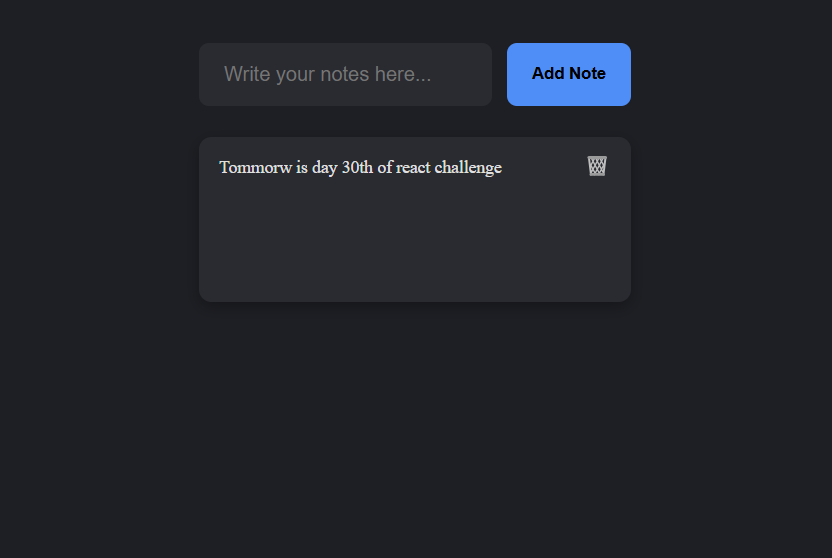

# 📝 Local Storage Notes App

A minimal and responsive **note-taking app** built with React. It uses local storage to persist your notes so you never lose track of your thoughts — even on refresh.

---

## 📌 Features
- ✅ **Add Notes**: Jot down anything on the fly.
- ✅ **Delete Notes**: Remove notes you no longer need.
- ✅ **Persistent Storage**: Notes are saved in `localStorage`.
- ✅ **Responsive & Simple UI**: Works great on all screen sizes.

---

## 🛠️ Technologies Used
- ⚛️ **React**
- 🎨 **CSS** (`Notes.css` for styling)
- 💾 **localStorage**

---

## 🚀 Live Demo
To see it in action, clone the repository and follow the setup instructions below.

1. **Clone the repository:**

   ```bash
   git clone https://github.com/Eshhaa11/local-storage-notes-website

2. **Navigate to the project directory:**

   cd local-storage-notes-website

3. **Install dependencies:**

   npm install

4. **Start the development server:**

   npm start

5. **Open your browser and visit:**

   http://localhost:3000

---

 ## 🎨 Screenshots:
 


 ---

 ## 🤝 Contributing:
 Want to improve this project? Fork the repository, create a feature branch, and open a pull request. All contributions are welcome! 🚀✨
 
 ---

 🎉 Happy Coding!
